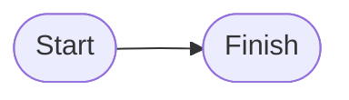
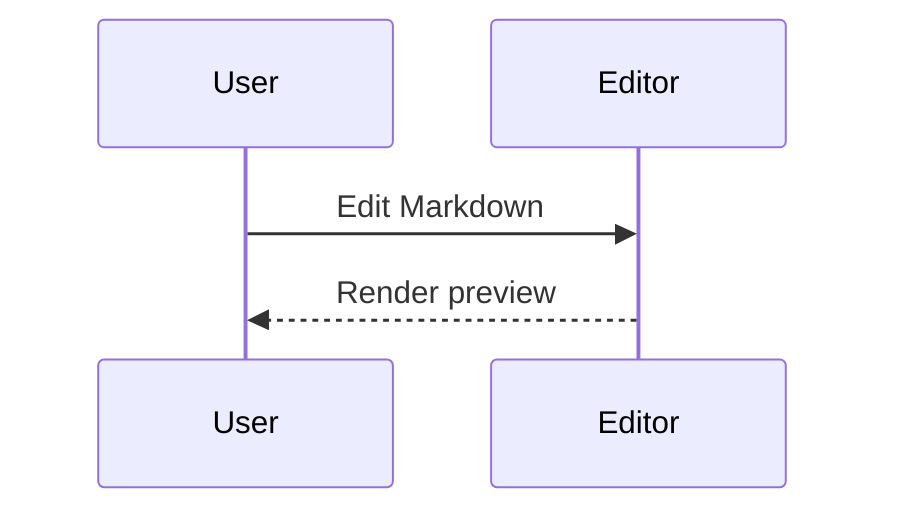
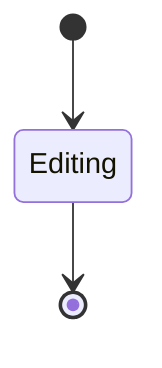
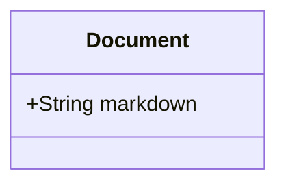
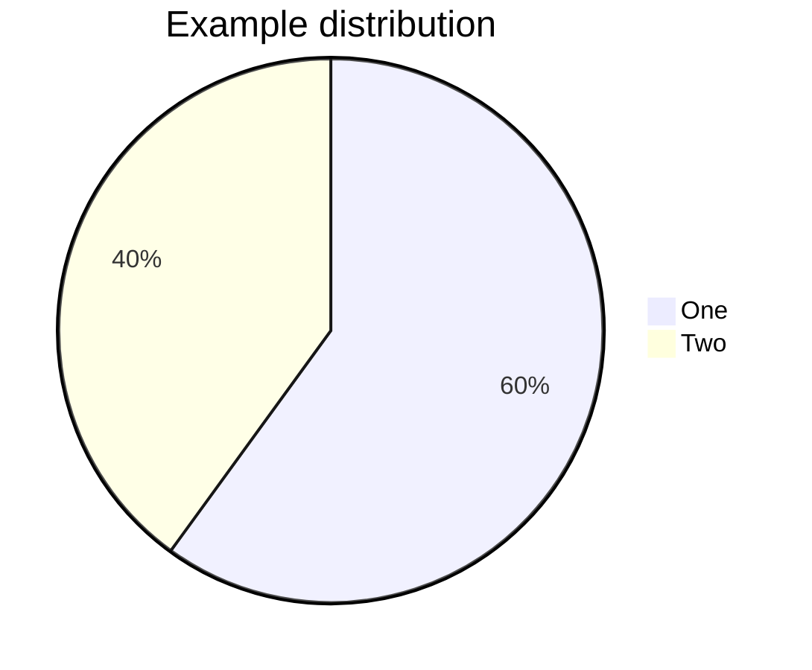
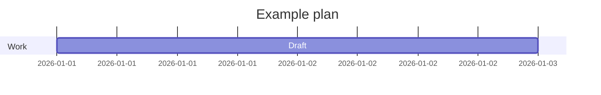

```mermaid
flowchart LR
  Start([Start]) --> Finish([Finish])
```

```mermaid
sequenceDiagram
  participant User
  participant Editor
  User->>Editor: Edit Markdown
  Editor-->>User: Render preview
```

```mermaid
stateDiagram-v2
  [*] --> Editing
  Editing --> [*]
```

```mermaid
classDiagram
  class Document
  Document : +String markdown
```

```mermaid
pie title Example distribution
  "One" : 60
  "Two" : 40
```

```mermaid
gantt
  title Example plan
  dateFormat YYYY-MM-DD
  section Work
  Draft :2026-01-01, 2d
```
