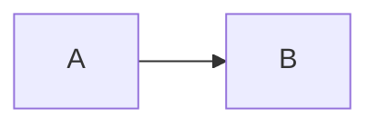

# Cherry renderer oracle

**bold** *italic* ~~strike~~ ++underline++ ~sub~ ^sup^

 { 汉字 | han zi }  !24 large!  !!#b42318 red!!  !!!#fff3cd highlighted!!!

1. ordered
2. second

- unordered
- [ ] task

::: info Oracle panel
Panel body remains source-backed.
:::

::: timeline Release
2026 - executable baseline
:::

+++ Disclosure
Hidden detail body
+++

| Name | Value |
| :--- | ---: |
| alpha | 1 |

```javascript
const exact = '<safe>'
```



[[toc]]
